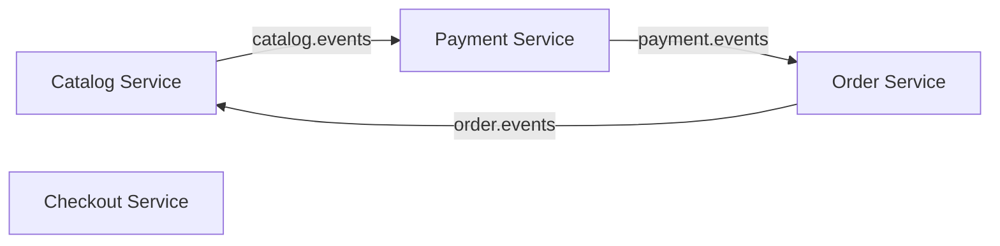
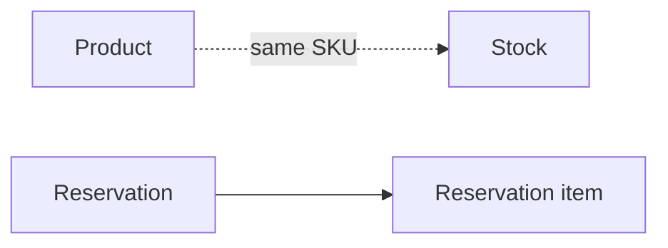
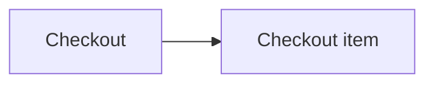
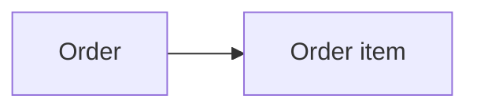
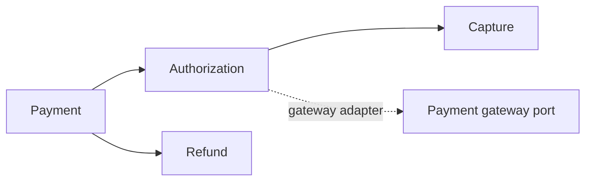
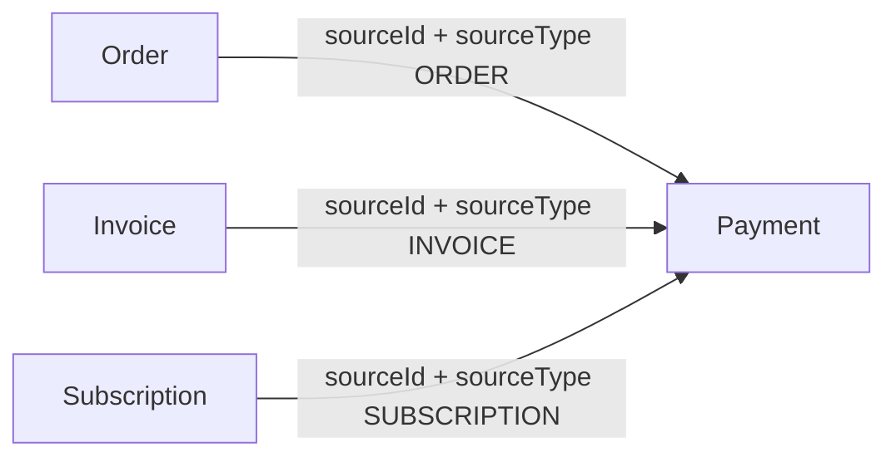

# Domain entities

This view separates entity ownership from cross-service communication. Lines within a service represent domain relationships; lines across services represent opaque references or events, never foreign keys.

## Catalog Service

Catalog has two logical modules in one deployable: **Product** and **Inventory**. They remain separate so Inventory can be extracted later without redesigning the model.

| Entity | Fields | Responsibility |
| --- | --- | --- |
| **Product** | `id`, `sku`, `name`, `price`, `status`, `createdAt`, `updatedAt` | What may be sold. |
| **Stock** | `sku`, `availableQuantity`, `reservedQuantity` | Current sellable stock state. |
| **Reservation** | `id`, `sourceId`, `items[]`, `status`, `createdAt`, `updatedAt` | Temporary reservation associated with an originating process. |
| **Reservation item** | `sku`, `quantity` | One stock demand within a reservation. |

`Product` and `Stock` meet through `sku`, but Stock is not an attribute of Product. Product describes the catalog; Inventory decides current availability.

## Checkout Service

| Entity | Fields | Responsibility |
| --- | --- | --- |
| **Checkout** | `id`, `items[]`, `total`, `status`, `createdAt`, `updatedAt` | Temporary preparation of a purchase. |
| **Checkout item** | `productId`, `quantity`, `unitPrice` | Product quantity with the price captured during checkout. |

Checkout retains `unitPrice` and does not own payment processing or the Order lifecycle.

## Order Service

| Entity | Fields | Responsibility |
| --- | --- | --- |
| **Order** | `id`, `items[]`, `total`, `status`, `createdAt`, `updatedAt` | Commercial transaction and its lifecycle. |
| **Order item** | `productId`, `quantity`, `unitPrice` | Immutable commercial line information. |

Order does not hold Payment IDs, Reservation IDs, gateway details, or authorization data. Progress from inventory and payment arrives through events.

## Payment Service

| Entity | Fields | Responsibility |
| --- | --- | --- |
| **Payment** | `id`, `sourceId`, `sourceType`, `amount`, `currency`, `paymentMethod`, `status` | Reusable payment lifecycle rooted in an opaque external source. |
| **Authorization** | `id`, `amount`, `gateway`, `status`, `createdAt`, `updatedAt` | Authorization attempt and gateway outcome. |
| **Capture** | `id`, `amount`, `status`, `createdAt`, `updatedAt` | Settlement of an authorized amount. |
| **Refund** | `id`, `amount`, `status`, `createdAt`, `updatedAt` | Return of a paid amount. |

### Why `sourceId` + `sourceType`?

Payment deliberately has no `orderId`. The `sourceId`/`sourceType` pair is an opaque boundary reference: it gives Payment enough context to associate a transaction, without making Order the only possible source. This preserves reuse for invoices, subscriptions, and future products, and prevents bidirectional coupling.

Authorization, Capture, Refund, and gateway routing remain modules of Payment Service. Gateway-specific logic belongs behind infrastructure adapters, not in the domain entities.

## Boundary rules

| Rule | Consequence |
| --- | --- |
| Each service owns its data. | No shared tables or cross-service joins. |
| References across boundaries are opaque. | Use `sourceId`, not another service's internal entity model. |
| Integration is event-oriented. | State changes move between services through Kafka contracts. |
| Deployments are independent. | A conceptual module becomes a separate service only when domain or operational complexity requires it. |
